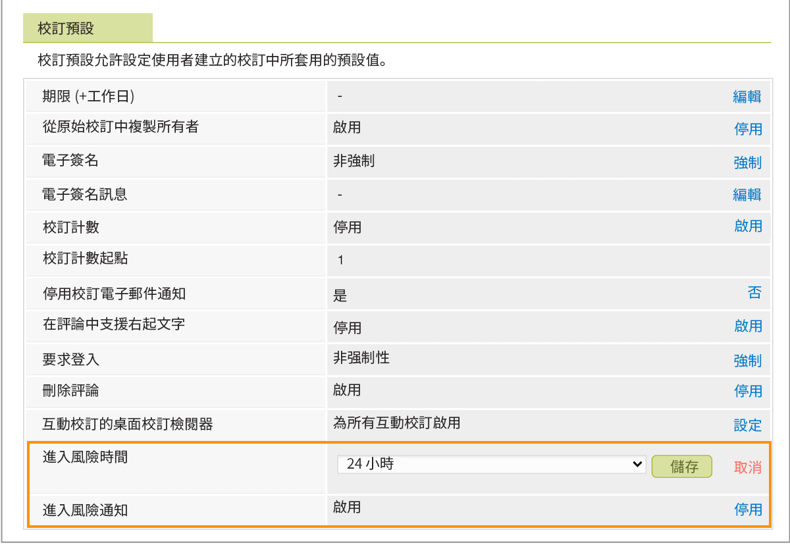

# 設定預設的有風險校訂設定

您想要針對 [!DNL Workfront] 送出的有風險通知進行設定。 這是對於尚未做出決定的校訂所有者和核准者發出的，關於校訂期限即將截止的溫和提醒。

預設啟動有風險通知，在校訂期限截止的 24 小時以前，校訂是「有風險」狀態。 [!DNL Workfront] 建議維持開啟這項通知，並將時間範圍設為 24 小時。 但是，若貴組織的校訂交期依小時而非天數計算，您可能想把通知期限縮短為僅數小時。

1. 在 [!DNL Workfront’s] [!UICONTROL 主選單]中選取「**[!UICONTROL 校訂]**」。
1. 在頂端導覽列選取「**[!UICONTROL 帳戶設定]**」。
1. 選取「**[!UICONTROL 設定]**」標籤。
1. 前往「[!UICONTROL 校訂預設值]」區段。
1. 在「[!UICONTROL 有風險時間]」欄位，選取「**[!UICONTROL 設定]**」。 然後選擇校訂期限截止之前應該傳送通知的小時數。
1. 選取「**[!UICONTROL 儲存]**」該設定。
1. 確認「[!UICONTROL 有風險通知]」欄位中顯示「[!UICONTROL 已啟用]」。 若不是，請按一下連結來開啟設定。

## 換您來操作

1. 登入 Workfront 並導覽至「設定」區域。 在「審閱和核准」區段，為指定的校訂收件者和非收件者挑選設定。
1. 現在使用 Workfront 的主選單前往校訂設定 (選取「校訂」)。 將國家、語言和時區設定為所有校訂和校訂使用者的預設值。
1. 如有必要，在校訂設定區域的「設定」標籤中調整「有風險」通知的時間。 與團隊討論使用校訂來決定效果最好的做法。

<!--
Lean More URLs
-->
