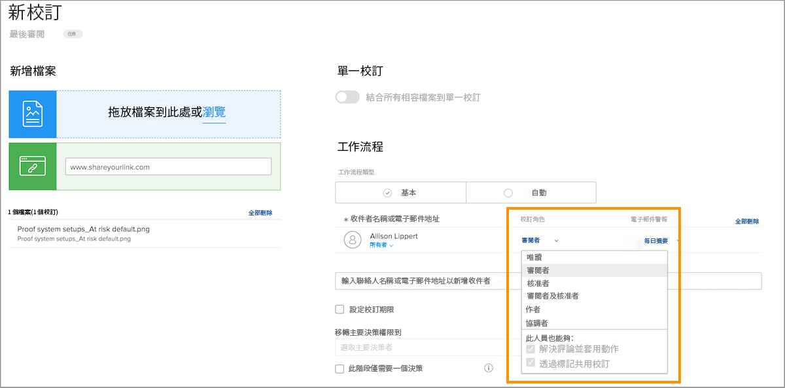
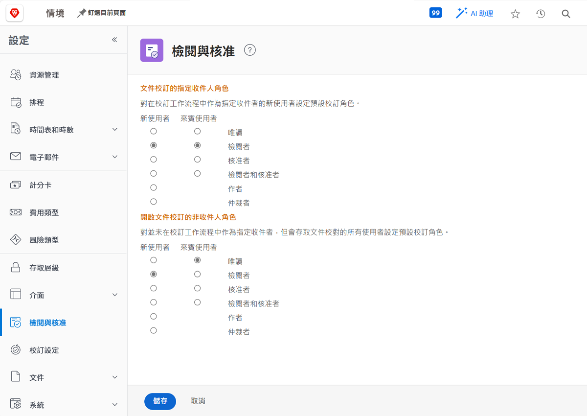

# 設定預設校樣角色

<!---
21.4 updates have been made
--->

完成的第一個預設設定是決定建立新使用者或開啟校樣時，要指派的預設校樣角色。

校樣角色決定使用者可以透過校樣做什麼，只需查看、發表意見、核准等。 [!DNL Workfront] 建議為所有使用者設定校樣角色預設值，讓將收件者新增至校樣，並更輕鬆快速地設定工作流程。

不過，此預設校樣角色可在個別校樣上傳時變更，確保每個人都能履行審核和核准程式中所需的角色。

## 設定預設校樣角色

1. 選擇 **設定** 從 [!UICONTROL 主菜單].
1. 選擇 **審核和批准** 的上界。
1. 按一下這兩個新角色所需預設校樣角色旁的按鈕 [!DNL Workfront] 「指定收件者」的用戶和來賓校樣用戶 — 手動或通過工作流模板添加到校樣工作流中的任何人。
1. 按一下這兩個新角色所需預設校樣角色旁的按鈕 [!DNL Workfront] 「非收件者」使用者的使用者和來賓校樣使用者。 這些通常 [!DNL Workfront] 有權存取校樣但不是指派給工作流程之人員的使用者。
1. 儲存變更。

請考慮將大部分的使用者和訪客新增至校對工作流程後，他們會做什麼。 這應該是您的預設值。
