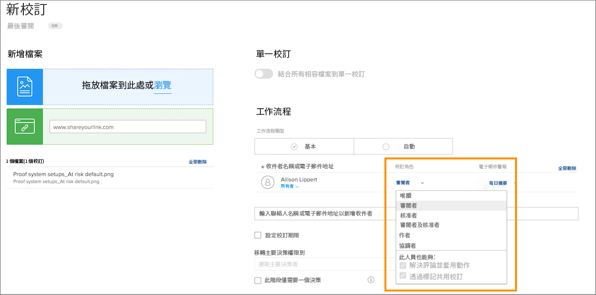
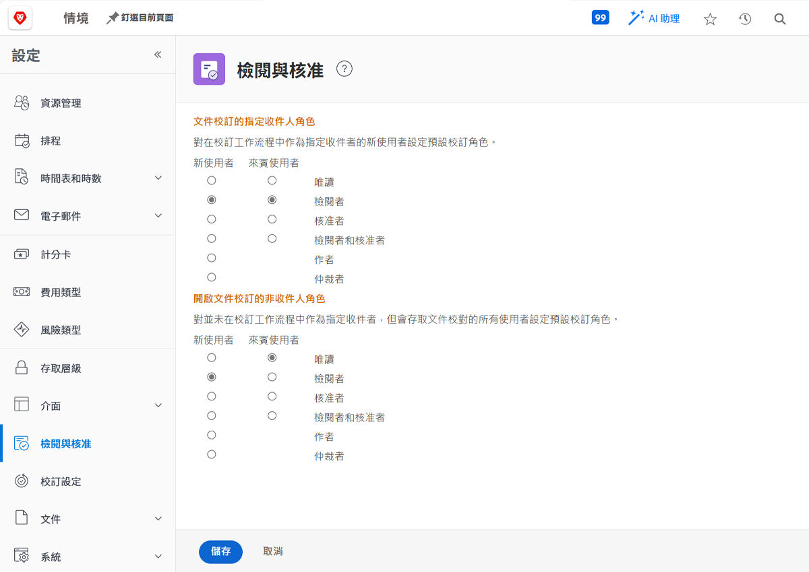

# 設定預設校訂角色

第一個預設設定是在建立新使用者或有人員開啟校訂時，決定要指派哪一種預設校訂角色。

校訂角色會決定使用者如何處理校訂，只需看看校訂、發表評論、核准等動作。[!DNL Workfront]建議為所有使用者設定校訂角色預設值，讓收件者新增到校訂中，並更快、更輕鬆地設定工作流程。

但是，在上傳個別的校訂時可以變更這個預設校訂角色，確保每個人都能夠履行他們在審閱和核准流程中所負責的角色。

## 設定預設校訂角色

1. 在[!UICONTROL 主選單]中選取「**設定**」。
1. 從左側選單選取「**審閱與核准**」。
1. 對於作為「指定收件者」的新 [!DNL Workfront] 使用者以及校訂訪客使用者，按一下所需的預設校訂角色旁邊的按鈕。「指定收件者」是指加入到校訂工作流程中的任何人，無論是手動或透過工作流程範本新增。
1. 對於作為「非收件者」的新 [!DNL Workfront] 使用者和校訂訪客使用者，按一下所需預設校訂角色旁邊的按鈕。 這些通常是可以存取校訂但是並未獲得指派參與工作流程的 [!DNL Workfront] 使用者。
1. 儲存變更。

考慮大部分使用者和訪客被新增到校訂工作流程時，預期會執行的工作。 這些應該是您的預設值。

## 最佳實務

| 最佳實務 | 原因說明 |
|---|---|
| 對於 Workfront 中「開啟文件校訂的非收件者之角色」設定，請僅使用「唯讀」或「審閱者」。 | 這項設定的其他選項皆要求做出校訂決定，而這樣可能會破壞訂工作流程。 一般而言，未加入校訂工作流程的人員只需要檢視校訂或留下註解，而不必實際核准校訂，因為「唯讀」或「審閱者」選項是最佳選擇。    備註：這項設定位在 Workfront 主選單 >「設定」>「審閱和核准」。 |
