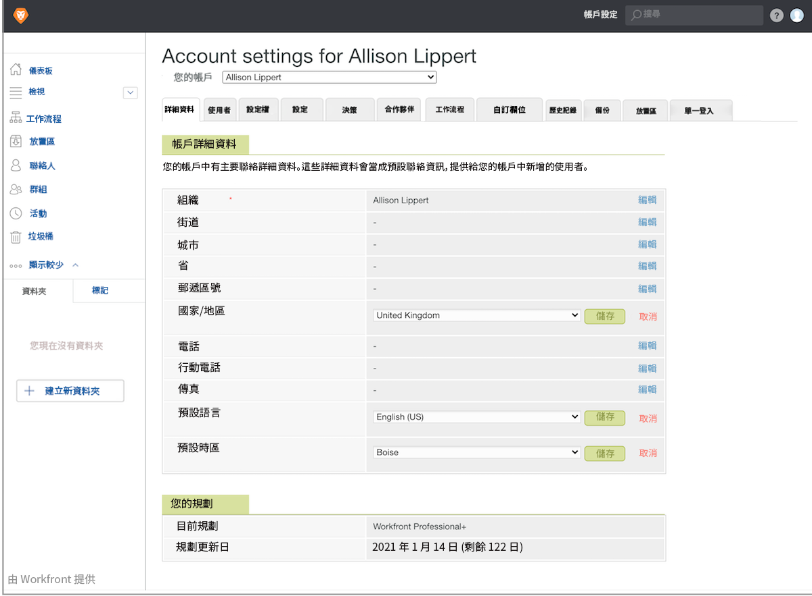

# 設定校訂帳戶預設設定

建立適用於所有校訂和校訂使用者的預設帳戶設定 — 國家、語言和時區。 如果您的使用者跨越多個時區或國家，您可以視需要在每個人的使用者設定檔上調整這些設定。

1. 選取 **[!UICONTROL 校訂]** 從 [!DNL Workfront’s] [!UICONTROL 主要功能表].
1. 選取 **[!UICONTROL 帳戶設定]** 導覽列上方的「 」。
1. 選取 **[!UICONTROL 詳細資料]** 標籤。
1. 前往 [!UICONTROL 國家] 欄位並選取 **[!UICONTROL 編輯]**. 選擇您的大多數校訂使用者所在的國家/地區作為預設值。
1. 選取 **[!UICONTROL 儲存]** 進行該設定。
1. 前往 [!UICONTROL 預設語言] 欄位並選取 **[!UICONTROL 編輯]**. 選擇大部分校訂使用者將用作預設的語言。
1. 選取 **[!UICONTROL 儲存]** 進行該設定。
1. 前往 [!UICONTROL 時區預設值] 欄位並選取 **[!UICONTROL 編輯]**. 選擇大部分校訂使用者將位於的時區作為預設值。 這將是手動設定的校訂工作流程所識別的時區。 它也適用於校訂工作流程範本，但每個範本都可以設定時區。
1. 選取 **[!UICONTROL 儲存]** 進行該設定。
