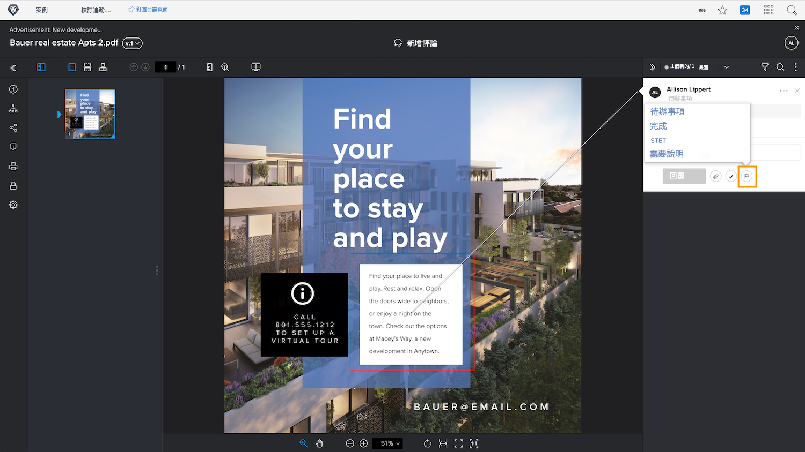
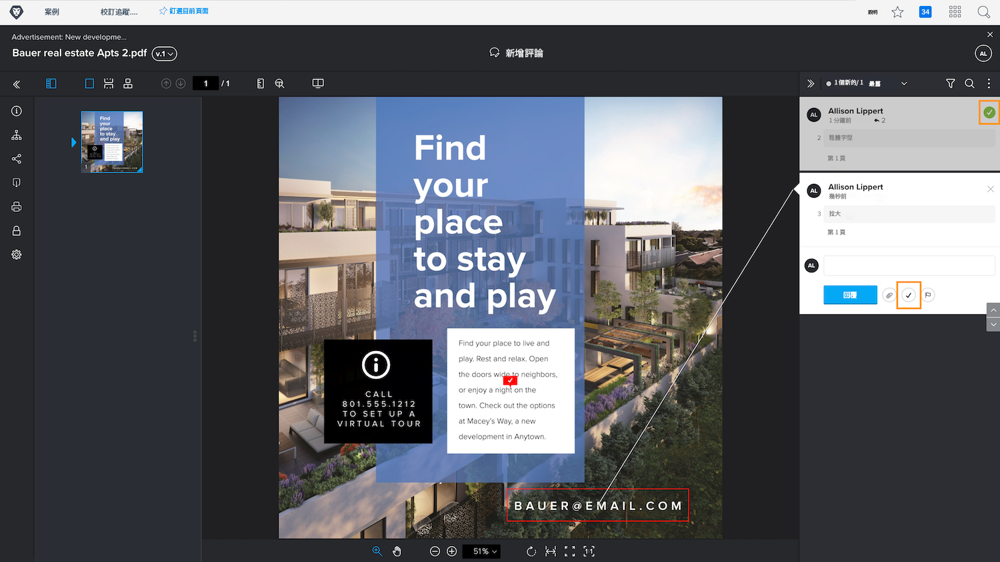

# 管理校訂評論

[!DNL Workfront] 可協助您透過註解動作或解析註解，追蹤和管理校樣上每個註解的相關工作（例如更正資產）。

校樣動作是評論上的「標幟」或「標籤」，通常用於表示有關評論已採取或需要採取的動作。 您可以從圖示或每個註解上的「更多」選單中選取動作。

例如，您應負責決定實際應完成稽核程式期間所做的哪些更正。 使用動作，您可以標籤相關註解，讓設計人員或編輯人員知道要進行哪些修訂。 然後，該人員可使用其他動作來指出已進行的變更。

![校訂檢視器中的校訂影像，具有 [!UICONTROL 待辦事項] 註解中反白顯示的校訂動作。](assets/manage-comments-2.png)

如果您的評論上未列出動作，表示貴組織尚未設定這些動作。 如果您認為動作是您的組織應該使用的動作，請洽詢校訂系統管理員。

「解決註解」特徵通常用於指示註解已以某種方式解決 — 已進行修正或已回答問題。 部分 [!DNL Workfront] 當評論是不需要進行的更正或只是已閱讀的評論時，客戶會「解決」評論。

按一下核取記號圖示來解決註解。 這會在註解上加上綠色核取記號，讓您在掃描註解欄時，輕鬆識別哪些註解已經檢閱。

您可以透過這兩項功能來篩選註解欄，協助您組織在使用校樣時看到的內容。

![在校樣檢視器中具有的註解篩選器影像 [!UICONTROL 動作] 和 [!UICONTROL 一般] 篩選選項反白顯示。](assets/manage-comments-3.png)

## 輪到你了

>[!IMPORTANT]
>
>別忘了提醒任何指派到校訂工作流程的同事，您正在使用校訂作為您Workfront培訓的一部分。

1. 尋找您已上傳至Workfront的證明。 開啟校樣檢視器以檢視已作出的評論並回複評論。 完成後，關閉校樣檢視器。
1. 使用「更新」區段（在「檔案詳細資訊」或「摘要」面板中）可檢視您已上傳至Workfront之校訂的最新註解。 回複評論。

<!--
## Learn more
* Create and manage proof comments
-->
