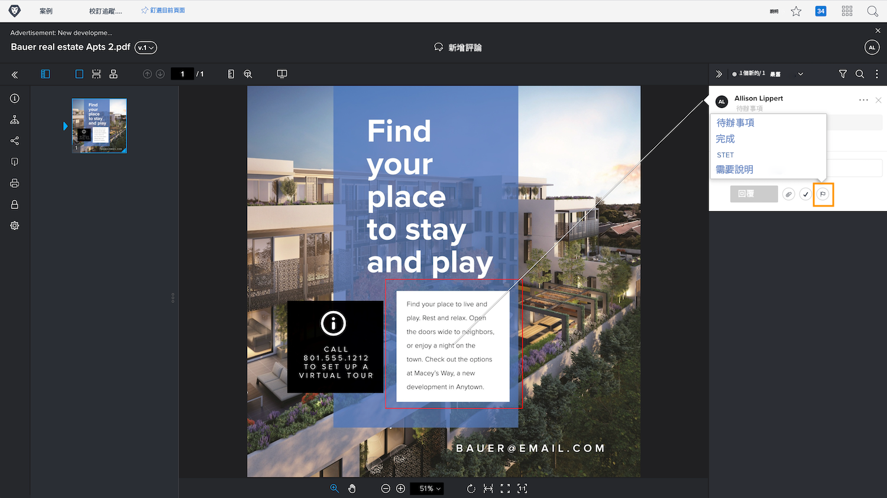
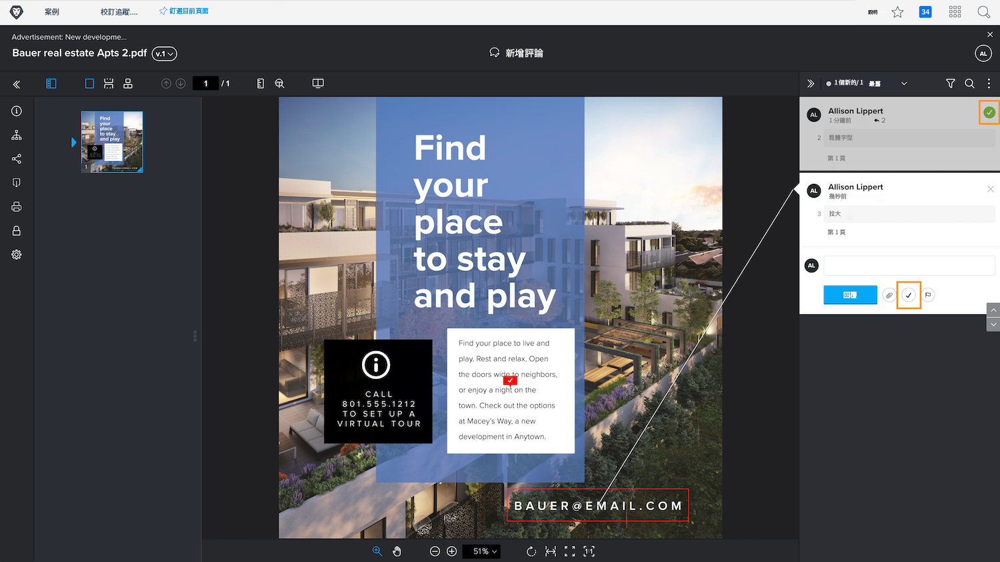

# 管理校訂註解

[!DNL Workfront] 會針對校訂上每個註解 (例如對資產進行更正) 執行註解動作或是解決註解，協助您追蹤和管理與註解相關的工作。

校訂動作是註解上的「旗幟」或「標籤」，經常用來表示對於註解已採取或需要採取的某個動作。 您可以從圖示或是每個註解的「更多」選單選取各項動作。

例如，您負責決定審閱過程中所做的更正哪一些應該實際執行。 您可以使用動作來標記相關註解，讓設計師或編輯者知道要執行哪一項修改。 該名人員接著可以用另一個動作來指出已進行變更。

![影像顯示校訂檢視器中的校訂，其註解上突顯標示「[!UICONTROL 待辦]」校訂動作。](assets/manage-comments-2.png)

若您的註解上未列出任何動作，則代表貴組織尚未設定動作。 如果您認為貴組織應該使用這些動作，請與您的校訂系統管理員討論。

「解決註解」功能通常用於表示已用某種方式解決該註解，包括已進行更正或已回答問題。 若是註解中的更正不需實際執行，或者純粹是已讀過的註解，有些 [!DNL Workfront] 也會「解決」這些註解。

按一下勾號圖示來解決註解。 這樣會在註解上顯示綠色勾號，這樣一來，當您瀏覽整個註解欄時，便可以輕鬆確認哪些註解已經審閱過。

您可以利用這兩種功能來篩選註解，在您處理校訂時協助編排您看到的內容。

![影像顯示校訂檢視器中的註解篩選器，其中突顯標示「[!UICONTROL 動作]」和「[!UICONTROL 一般]」篩選選項。](assets/manage-comments-3.png)

## 換您來操作

>[!IMPORTANT]
>
>請記得提醒指派至校訂工作流程的任何同事，您因為參加 Workfront 培訓正在處理校訂。

1. 在 Workfront 中尋找您已上傳的校訂。 開啟校訂檢視器來查看所留下的註解並回覆註解。 完成後請關閉校訂檢視器。
1. 使用「更新」區段，無論在「文件詳細資料」或是摘要面板，在 Workfront 中檢視您已上傳的校訂上最新的註解。 回覆註解。

<!--
## Learn more
* Create and manage proof comments
-->
