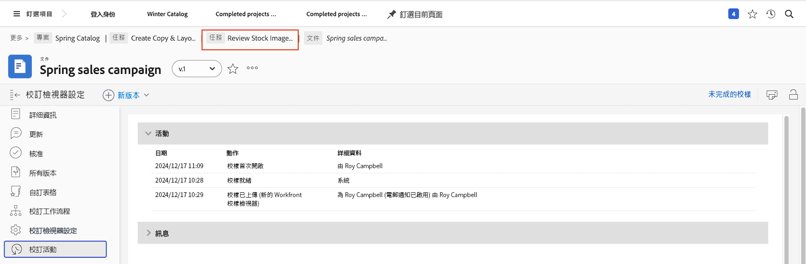

# 了解校樣詳細資訊

## 查看校樣詳細資訊

身為校樣管理員或擁有者，您可以透過摘要面板和 [!UICONTROL 文檔詳細資訊] 頁面。 首先，在 [!UICONTROL 檔案] 項目、任務或問題的部分。

### 摘要面板

摘要面板提供校樣基本詳細資訊的概觀。 需要時，可使用圖示展開面板，不需要時可折疊面板。您甚至可以將滑鼠移到校樣的縮圖上，以開啟或下載校樣。

![的影像 [!UICONTROL 檔案] 已選取校樣且「摘要」面板已展開的專案區段。 摘要面板圖示和摘要面板都會反白顯示。](assets/document-summary.png)

注意：此 [!UICONTROL 核准] 摘要面板中的區段適用於 **檔案** 核准與 **不是** 與您在本課程中學到的校樣審核和核准程式相關。 這兩個程式在 [!DNL Workfront].

### [!UICONTROL 文件詳細資訊]

若您需要有關校樣的更多資訊， [!UICONTROL 文檔詳細資訊] 連結會帶您前往校樣的「頁面」，位於 [!DNL Workfront].

![校樣頁面的影像，位於 [!DNL  Workfront].](assets/document-details.png)

請務必注意，查看校對程式相關資訊的能力取決於 [!DNL Workfront].

從校樣的頁面，您可以從左側面板功能表存取這些區段：

* **更新 —** 在校樣檢視器中所做的留言會顯示在此處，並帶有「校樣留言」標籤。 您也可以在檔案上留言，就像在任務或專案上留言一樣（這些留言不會出現在校樣檢視器中）。
* **批准 —** 此部分用於文檔批准，而非校對批准。 兩種核准類型是 [!DNL Workfront] 並且不要連結在一起。 如果您使用校樣工作流程進行審核和核准，則不使用本區段。
* **所有版本 —** 追蹤及管理校樣的版本記錄。 您可能會發現，在 [!UICONTROL 檔案] 清單。
* **自訂Forms —** 自訂表單用於校樣，以擷取組織專屬資訊。 此資訊可與檔案一起傳遞到整合的文檔儲存系統，例如 [!DNL Workfront] DAM或 [!DNL Adobe’s] AEM。 自訂表單由 [!DNL Workfront] 系統管理員或群組管理員。 請洽詢您的團隊或管理員，了解您是否要在校樣上使用自訂表單。
* **校對工作流程 —** 管理或修改指派給校樣的工作流程。 您可以使用 [!UICONTROL 校對工作流程] 在 [!UICONTROL 檔案] 清單。 了解如何使用編輯校樣工作流程影片來變更工作流程。

讓我們進一步了解其中的兩個部分： [!UICONTROL 校對檢視器設定] 和 [!UICONTROL 校對活動].

### [!UICONTROL 校訂檢視器設定]

這些設定可協助您控制校樣本本身的存取權。

![的影像 [!UICONTROL 校對檢視器設定] 從校樣的頁面和 [!UICONTROL 校對檢視器設定] 選項，在左側面板菜單中突出顯示。](assets/proofing-settings-on-details-page.png)

* **[!UICONTROL 需要登入. 此校樣無法與來賓用戶共用] —** 校樣只能與具有 [!DNL Workfront] 校對許可證。
* **[!UICONTROL 要求以電子方式簽署決定] —** 共用校樣時，收件者必須擁有 [!DNL Workfront] 在做出證明決定時，通過輸入校對密碼，使他們「以電子方式簽署」證明。 (注意：校對密碼與 [!DNL Workfront] 密碼。 校對密碼不易存取，因此大部分收件者都不知道此密碼。) [!DNL Workfront] 建議您 [!DNL Workfront] 顧問。
* **[!UICONTROL 做出所有必要決策時鎖定校樣 ]—** 一旦對證明做出每項決定，就會將證明鎖定在任何進一步的評論、回覆、決定等。 這會鎖定整個校樣版本，而不只是校樣工作流程的特定階段。
* **[!UICONTROL 允許下載原始檔案] —** 校樣收件者可從校樣檢視器下載校樣的原始來源檔案（選項位於右側面板功能表中）。
* **[!UICONTROL 允許透過公用URL或內嵌程式碼共用校樣] —** 證明收件者可與任何人共用公開存取的證明連結。
* **[!UICONTROL 允許透過公用URL或內嵌程式碼訂閱校樣] —** 任何已傳送公用URL的人，都可以使用其電子郵件地址和名稱（如果不是校樣使用者）或其電子郵件地址和校樣密碼（如果是校樣使用者）將自己新增至校樣。 (注意：校對密碼與 [!DNL Workfront] 密碼。)

校樣上傳到 [!UICONTROL 校樣設定] 區段（位於上傳視窗底部）。

![的影像 [!UICONTROL 校樣設定] 區段。](assets/proof-settings-on-upload-page.png)

### [!UICONTROL 校對活動]

此頁面會追蹤校樣上發生的所有活動，以及與此校樣相關而傳送的電子郵件訊息。

![的影像 [!UICONTROL 校對活動] 包含 [!UICONTROL 校對活動] 選項，在左側面板菜單中突出顯示。](assets/proofing-activity-in-details.png)

此 [!UICONTROL 活動] 章節提出意見和決定的時間戳記，以及由誰作出決定。 它也會追蹤校對工作流程階段何時開始、收件者首次開啟校樣時，以及校樣管理員或擁有者想要知道的其他資訊。 當您嘗試了解校對工作流程階段為何從未啟動時(例如，

此 [!UICONTROL 訊息] 區段電子郵件警報和訊息傳送給收件者、傳送者及訊息內容的時間戳記。 如果有人說未收到校樣的電子郵件，疑難排解時，這個功能會很實用。 您可以檢查是否及何時傳送電子郵件。

[!DNL Workfront] 建議校樣管理員和校樣擁有者熟悉這兩個區段的資訊。 當您結合這些資訊並了解如何閱讀 [!UICONTROL SOCD] 進度列中，無論校樣位於校樣工作流程的哪個位置，您都能確實了解和管理校樣。

一旦您完成在 [!UICONTROL 文檔詳細資訊] 區段中，使用階層連結路徑來返回 [!UICONTROL 檔案] 項目、任務或發佈的部分附加校樣。

<!--
#### Learn more
* [!UICONTROL Document details] overview
* Add a custom form to a document
* Request document approvals
* Summary for documents overview
* View activity on a proof within [!DNL Workfront]
-->
