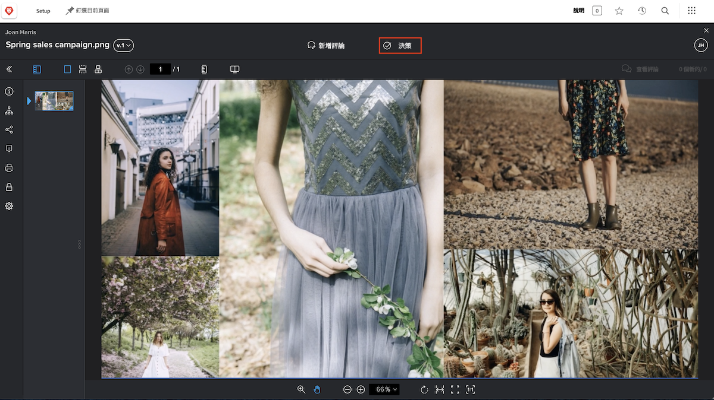
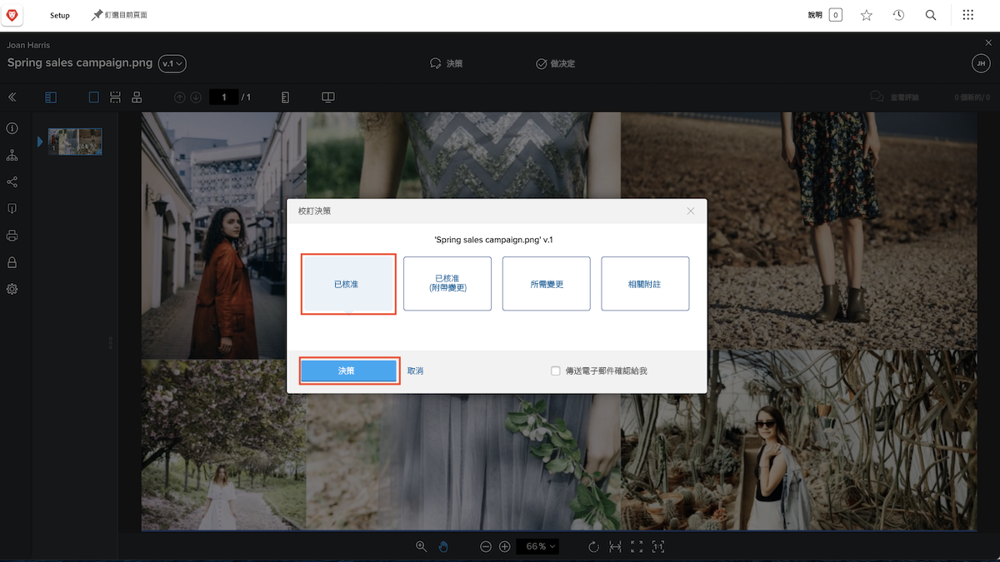

# 審閱及核准校訂

在開始審閱校訂之前，請確保您知道別人對於這項工作的預期。您在校訂工作流程中扮演什麼角色？審閱校訂、核准校訂，或是兩者皆有？

作為文案編輯，您的重點可能是審閱校訂是否有語法錯誤和拼寫錯誤。行銷和創意團隊可能著重於資產的設計並確保符合企業品牌。法務團隊可以確認服務合約的用字遣詞是否嚴謹。而專案經理人可能要確認所審閱的內容符合相關專案的目的與目標。

您可能也要負責核准校訂。核准校訂表示您認為「這份作品沒問題，已準備好發佈」。或者您可能認為「這份作品需要變更，請送回去進行修改」。

您知道工作的相關預期之後，便可以開始審閱校訂。

## 收到要審閱的校訂

當資產準備好進行審閱和核准時，您會收到電子郵件通知。

![影像顯示 [!DNL  Workfront] 中有一封新的校訂電子郵件請求進行兩份校訂的審閱與核准。](assets/new-proof-emails.png)

請注意，此一校訂連結是唯一提供給您使用。如果您與他人共用連結，他們留下的任何註解和記號都會標記您的名稱。

「[!UICONTROL 新增校訂]」電子郵件亦包含關於校訂的重要資訊：

* 電子郵件的主旨行是校訂的名稱。
* 您可以利用縮圖快速瀏覽要審閱的內容。
* 您可以透過版本編號知道正在檢閱哪一版本的校訂。
* 以及最重要的是，電子郵件中有兩個位置顯示截止期限 - 校訂詳細資料區段的正上方以及您所在工作流程階段的灰色橫條中。

您準備好開啟審閱時，只需要按一下「[!UICONTROL 前往校訂]」的藍色按鈕，檔案便會自動在 [!DNL Workfront] 校訂檢視器中開啟。

### 從[!UICONTROL 首頁]開啟校訂

若您正使用 [!DNL Workfront] 並收到核准校訂的要求，您會在 [!DNL Workfront] [!UICONTROL 首頁]的「[!UICONTROL 我的核准]」小工具中看到指派。

![[!DNL Workfront][!UICONTROL  首頁]上「[!UICONTROL 我的核准] 」小工具的影像。](assets/open-proof-from-home.png)

值得注意的是，唯有在您被指派負責核准時，校訂才會出現在 [!DNL Workfront] [!UICONTROL 首頁]。若您僅需審閱校訂，便不會顯示在 [!DNL Workfront] [!UICONTROL 首頁]上。

按一下「[!UICONTROL 前往校訂]」連結以在校訂檢視器內開啟。

根據貴組織的校訂和專案工作流程，您可能會在 [!DNL Workfront] [!UICONTROL 首頁]看到任務指派而不是校訂核准請求。在這種情況下，您會在任務本身的「[!UICONTROL 文件]」區段開啟校訂 (請參閱下方指示)。

您也可能在團隊或組織為了協助管理校訂工作流程而特別建立的 [!DNL Workfront] 儀表板上，看到要審閱的校訂。

### 開啟專案、任務或問題的校訂

如果您通常在 [!DNL Workfront] 中處理專案、任務或問題，您可能偏好直接在該項目的「[!DNL Documents]」區段直接開啟校訂。

![影像顯示在 [!DNL  Workfront] 任務中的「[!UICONTROL 文件]」區段，其中突顯標示「[!UICONTROL 開啟校訂]」連結。](assets/open-proof-from-documents.png)

1. 按一下專案、任務或問題的名稱。
2. 在項目頁面的左側面板選單中按一下「[!UICONTROL 文件]」。
3. 在「[!UICONTROL 文件]」清單中尋找校訂。
4. 按一下「[!UICONTROL 開啟校訂]」連結來開啟校訂檢視器。

## 如何核准校訂

開啟校訂後，您將看到上方的「**做出決策**」按鈕，位在「**新增註解**」旁邊。如果您不是此校訂的核准者，您不會看到這個按鈕。

當您準備好做出決策時，請按一下「**做出決定**」按鈕查看您的決策選項。選取您的選擇，然後按一下以下其他「**做出決策**」按鈕。

## 審閱及核准校訂

觀看這段影片，您將瞭解如何：

* 瞭解對於您審閱校訂的預期
* 在校訂上留下註解
* 使用記號來指示校訂所需的變更
* 回覆校訂註解
* 核准或拒絕校訂

>[!VIDEO](https://video.tv.adobe.com/v/335141/?quality=12&learn=on&enablevpops=1)

<!--
#### Learn more
* Create and manage proof comments
* Make decisions on a proof
* Review a static proof
* Tag users to share a proof
* Notifications for proof comments and decisions
-->

<!--
#### Guides
* Reviewing proofs in [!DNL Workfront]
* -->
