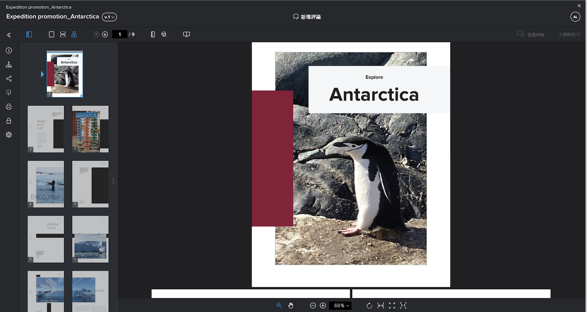
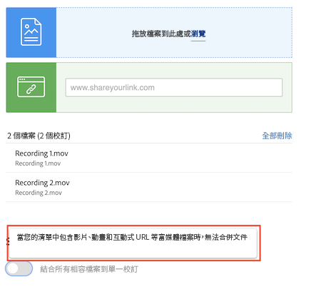

# 將多個檔案合併為單一校訂

將多個檔案合併為單一校訂，通常會讓校訂流程更精簡。

當個別檔案與整個可交付成果相關或是其一部分，而且所有檔案必須由相同人員按照相同的截止期限進行檢閱時，「合併」選項是很實用的功能。

例如，創意團隊設計一本小冊子。四位設計師製作這些頁面並個別儲存成 PDF。如果每個設計師上傳這些 PDF 進行個別校訂，則檢閱者必須檢閱四份不同的校訂。此外，要確保小冊子各部分能夠順利組合起來的難度也更高。

解決方案 — 讓一個人上傳所有 PDF，並在上傳時將檔案合併為單一校訂。這樣一來，檢閱者可以將小冊子視為整體，而不是互不相連的部分。

若要合併校訂：

1. 開啟應附加該校訂的專案、任務或問題的「[!UICONTROL 文件]」區段。
2. 將檔案拖放到上傳區域或是進行瀏覽。[!DNL Workfront] 支援合併最多 50 個檔案。
3. 將「[!UICONTROL 將所有相容檔案合併成單一校訂]」選項切換為開啟。
4. 輸入合併校訂的名稱。這是必填項目。
5. 如有需要，您可以在上傳清單上使用拖放方式變更要合併的檔案之順序。
6. 新增校訂收件者、設定截止期限等。
7. 按一下「[!UICONTROL 建立校訂]」來完成上傳。

![影像顯示「[!UICONTROL 新增校訂]」視窗，其中突顯標示已上傳的檔案清單與「[!UICONTROL 單一校訂]」區段。](assets/combine-proofs.png)

校訂上傳完成後，您將在「[!UICONTROL 文件]」標籤中看到一個 ZIP 檔案。

檢視合併的檔案不需要任何其他操作。像平常一樣按一下「[!UICONTROL 開啟校訂]」，校訂便會在校訂檢視器中開啟。

## 是否可以合併影片檔案？

抱歉，當您的清單中包含影片、動畫和互動式 URL 等多媒體檔案時，無法合併檔案。

## 換您來操作

>[!IMPORTANT]
>
>在進行 Workfront 培訓的過程中，請記得提醒您的同事，您會把校訂傳送給他們。

尋找三個或四個檔案 (PDF、文字檔案等)，就在您的電腦上。

1. 開啟您所使用的專案、任務或問題，在 Workfront 中進行親手操作練習。
1. 上傳檔案並把它們合併成單一校訂。
1. 調整檔案的順序，把清單中最後一項移到清單的第一項。
1. 指派您選擇的工作流程 (基本或自動化) 並完成上傳。

<!--
##Learn more
* Create a multi-page proof
-->
