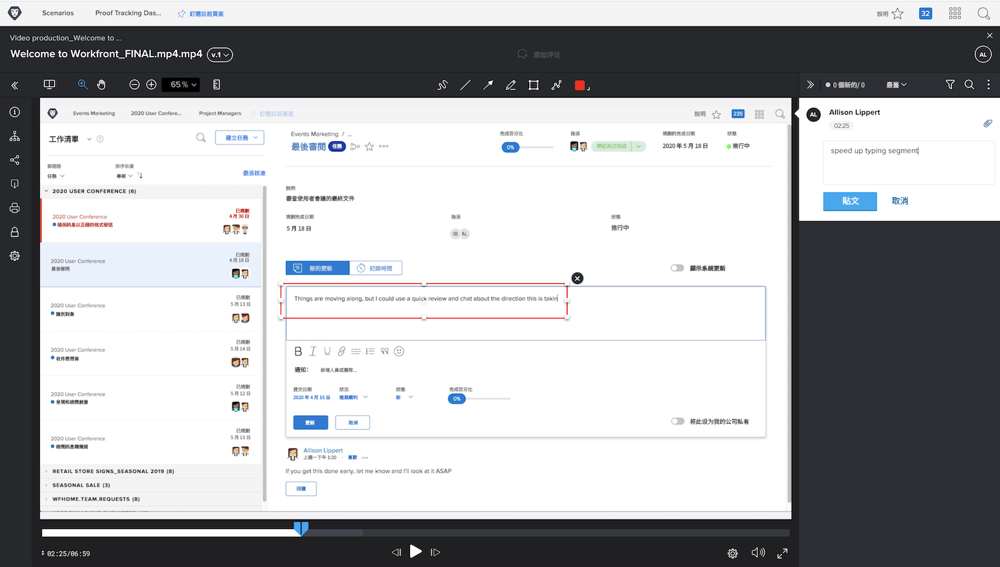

# 上傳影片校樣

[!DNL Workfront’s] 校對功能不僅適用於PDF、試算表或影像等靜態檔案。 [!DNL Workfront] 支援超過150種檔案類型，包括大小高達4GB的視訊和Web捕獲。

請記住，要上傳較大的檔案需要更久的時間。 開始大型上傳之前，請確定您的網際網路連線穩定，因為中斷可能會終止上傳程式。

<!-- For a complete list of uploadable file types, see the article, Supported proofing file types. -->

[!DNL Workfront’s] 校樣檢視器是檢閱和核准影片檔案的理想場所。 校樣收件者可以直接在校樣檢視器中播放影片。 註解會加上時間戳記，因此您確切知道註解要參照的影片部分。 校樣收件者甚至可以使用標籤工具，並直接在暫停的視訊上畫圖。

支援的視訊類型包括MOV、MP4和H.264。 <!-- Check the supported file types list to make sure the video type you use is compatible with Workfront’s proofing features.-->

上傳影片至 [!DNL Workfront] 執行的步驟與上傳靜態檔案相同。

* 開啟應上傳至的專案、工作或發佈影片。
* 選擇 [!UICONTROL **檔案**] 的上界。
* 從 [!UICONTROL **新增** ]按鈕，選擇 [!UICONTROL **校樣**].
* 將視訊檔案拖放至上傳區域或使用瀏覽功能。
* 指派基本或自動化的工作流程。
* 設定最後期限。
* 按一下 [!UICONTROL **建立校樣**] 完成。

## 該你了

>[!IMPORTANT]
>
>別忘了提醒同事，您會在Workfront訓練中向他們傳送校樣。

如果您有可用的視訊檔案，請將其上傳至Workfront中的實務專案、工作或問題。 應用與通常使用的工作流相似的基本或自動化工作流，或者應用實際工作流（如果您已經知道它是什麼）。

