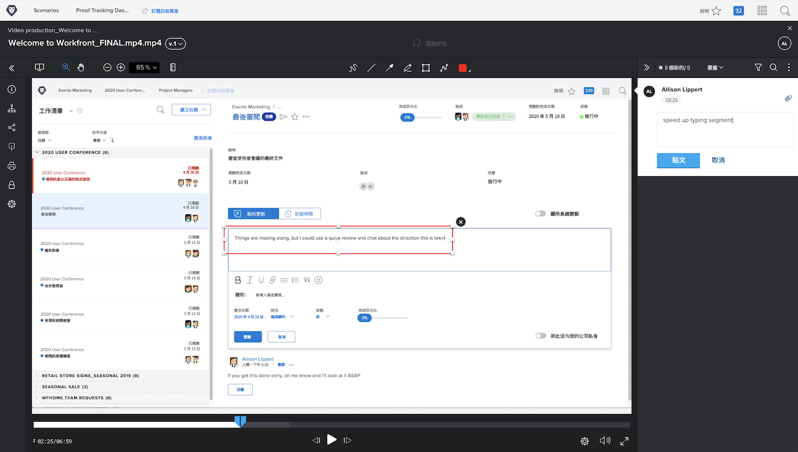

# 上傳影片的校訂

[!DNL Workfront’s]校訂功能並不限於靜態的檔案，如 PDF、試算表或影像。 [!DNL Workfront] 支援超過 150 種檔案類型，包括最大 4 GB 的影片與網頁截圖。

請記住，較大的檔案需要更長的上傳時間。 在開始大量上傳之前，請確保您的網際網路連線穩定，因為連線中斷可能會終止上傳過程。

<!-- For a complete list of uploadable file types, see the article, Supported proofing file types. -->

[!DNL Workfront’s] 校訂檢視器是審閱和核准影片檔案的理想選擇。 校訂收件者可以直接在校訂檢視器中播放影片。 註解均有時間戳記，因此您可以準確知道註解所指是影片哪個部分。 校訂收件者甚至可以使用標記工具，直接在暫停播放的影片上標註記號。

所支援的影片類型包括 MOV、MP4 和 H.264。<!-- Check the supported file types list to make sure the video type you use is compatible with Workfront’s proofing features.-->

在 [!DNL Workfront] 中上傳影片，其步驟與上傳靜態檔案相同。

* 開啟要上傳影片的專案、任務或問題。
* 從左側面板選單選取「[!UICONTROL **文件**]」。
* 從「[!UICONTROL **新增**]」按鈕，選取「[!UICONTROL **校訂**]」。
* 把影片檔案拖放到上傳區域，或使用瀏覽功能。
* 指派基本或自動化工作流程。
* 設定截止期限。
* 按一下「[!UICONTROL **建立校訂**]」來完成作業。

## 換您來操作

>[!IMPORTANT]
>
>在進行 Workfront 培訓的過程中，請記得提醒您的同事，您會把校訂傳送給他們。

如果您有可用的影片檔案，請將檔案上傳到 Workfront 中的練習專案、任務或問題。 套用與您平常所用類似的基本或自動化工作流程，或套用實際的工作流程，若您已經知道該流程的話。

