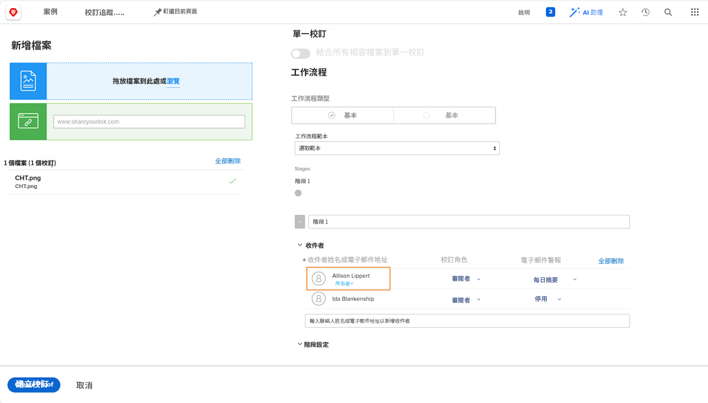

# 使用自動化工作流程上傳校樣

在此影片中，您將學習：

* 可使用自動校樣工作流程時
* 如何使用校樣範本套用工作流程
* 如何從頭開始設定自動化工作流程

>[!VIDEO](https://video.tv.adobe.com/v/335133/?quality=12)

## 其他校樣工作流程設定

校樣上傳視窗底部的設定為選用，因此請洽詢您的組織，查看是否使用校樣及其使用方式。

![的影像 [!UICONTROL 新校樣 ]窗口 [!UICONTROL 舞台設定] 突出顯示。](assets/additional-proof-workflow-settings.png)

* **[!UICONTROL 鎖台] —** 這可防止此工作流程階段的人員在完成其工作流程階段後進行註解或變更決策。
* **[!UICONTROL 將主要決策權轉讓至] —** 通過指定主決策者加快校對過程。 設定後， [!DNL Workfront] 確認此人的證明決定為THE決定。 一旦那個人做出決定，舞台就結束了，不需要其他決定。
* **[!UICONTROL 此階段只需要一個決策] —** 簡化校對流程的另一種方法是，只需對校樣作出一個決定。 開啟後，無論您在該階段中有多少批准者，一旦任何批准者做出決定，該階段就會完成。
* **[!UICONTROL 將此階段設為私人] —** 依預設，所有階段的每個人都可看到校樣的註解。 按一下方塊，防止其他階段的校樣收件者看見在此階段中所做的留言。

校樣上傳視窗底部有數個影響校樣安全性的校樣設定，例如需要登入才能檢視校樣。

<!--
Learn more about these in the Proof settings section of the Configure a proof article.
-->

![的影像 [!UICONTROL 校樣設定] 校樣上傳視窗的區段。](assets/additional-proof-workflow-settings-2.png)

<!--
### Learn more
* Automated workflow overview
* Automated workflow stages overview
-->

<!--
### Guides
* Plan an advanced workflow worksheet
-->

## 您為何要執行校樣工作流程？

您會注意到您位於校樣收件者清單中，因為您是上傳校樣的收件者。 這也會讓您成為校樣擁有者，提供您校樣的編輯權限，讓您變更工作流程設定或上傳新版本等。

如果您只是上傳校樣，但其他人將管理工作流程，您可以按一下 [!UICONTROL 擁有者] 連結並輸入其名稱。 如果原始上傳程式以外的其他人將上傳版本，則建議使用此方法。

## 該你了

>[!IMPORTANT]
>
>別忘了提醒同事，您會在Workfront訓練中向他們傳送證明。

使用進階工作流程上傳校樣。 如果貴組織已設定校樣範本，請選取團隊使用的範本，然後進行一些調整。

* 調整電子郵件警報，以便在校樣上發生活動時，不會收到通知。
* 第一階段應有2名審核者/批准者。
* 第二階段應僅有1個審核者/核准者。

如果您的組織尚未建立校樣範本，請從頭開始設定2階段的工作流程。

* 將您自己和您最喜愛的同事分配到第一個階段。
* 將建立校樣的第一階段設為1天的截止日期。
* 將另一個最喜愛的同事分配到第二階段。
* 當第一階段的截止日期過後，舞台就開始。
* 請在此階段中為人員提供2天的時間以完成審核，但必須在中午前完成。

