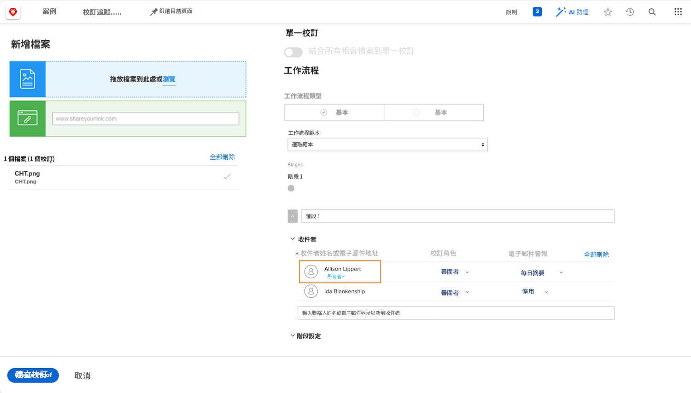

# 使用自動化工作流程上傳校訂

觀看這段影片，您將會瞭解：

* 何時可以使用自動化校訂工作流程
* 如何使用校訂範本套用工作流程
* 如何從頭開始設定自動化工作流程

>[!VIDEO](https://video.tv.adobe.com/v/335133/?quality=12&learn=on&enablevpops=1)

## 其他校訂工作流程設定

校訂上傳視窗底部的設定是選用設定，因此請向您的組織確認您是否使用或如何使用這些設定。

![影像顯示「[!UICONTROL 新增校訂]」視窗並突顯標示「[!UICONTROL 階段]」設定。](assets/additional-proof-workflow-settings.png)

* **[!UICONTROL 鎖定階段] —**&#x200B;防止這個工作流程階段的人員在工作流程階段完成後留下註解或更改決策。
* **[!UICONTROL 將主要決策權轉讓給] —**&#x200B;指定主要決策者來加快校訂過程。 設定後，[!DNL Workfront] 會將此一人員的校訂決定認定為最終決定。 該人員一旦做出決定，這個階段就結束了且不需要其他決定。
* **[!UICONTROL 此階段僅需要一個決定] —**&#x200B;簡化校訂過程的另一種方法是只需要一個校訂決定。 啟用此功能後，無論該階段有多少核准者，只要他們其中任何一位做出決定，便是完成該階段。
* **[!UICONTROL 將此階段設為私人] —**&#x200B;依預設，所有階段的每個人都看得見校訂上的註解。 在這個階段按一下方塊，可以避免其他階段的校訂收件者看到註解。

校訂上傳視窗底部有數個會影響校訂安全性的校訂設定，例如要求登入才能檢視校訂。

<!--
Learn more about these in the Proof settings section of the Configure a proof article.
-->

![影像顯示校訂上傳視窗的「[!UICONTROL 校訂設定]」區段。](assets/additional-proof-workflow-settings-2.png)

<!--
### Learn more
* Automated workflow overview
* Automated workflow stages overview
-->

<!--
### Guides
* Plan an advanced workflow worksheet
-->

## 為什麼您是校訂工作流程的一員？

您注意到自己也在校訂收件者清單上，因為您是上傳校訂的人。 您因此成為校訂所有者，並擁有校訂的編輯權限，允許您變更工作流程設定或上傳新版本等。

如果您只是上傳校訂，但由其他人管理工作流程，您可以按一下「[!UICONTROL 所有者]」連結並輸入其名稱來變更校訂所有者。 如果原始上傳者以外的其他人將會上傳某個版本，我們建議使用這樣的方法。

## 換您來操作

>[!IMPORTANT]
>
>在進行 Workfront 培訓的過程中，請記得提醒您的同事，您會把校訂傳送給他們。

使用進階工作流程上傳校訂。 若您的組織已經設定校訂範本，請選取您的團隊所使用的範本再進行若干調整。

* 調整電子郵件警報，以便校訂上發生活動時沒有人會收到通知。
* 第一階段應有 2 名審閱者/核准者。
* 第二階段應該只有 1 個審閱者/核准者。

如果您的組織尚未建立校訂範本，請從頭開始設定兩階段工作流程。

* 將您自己和喜愛的同事指派到第一階段。
* 將第一階段的截止日期設為建立校訂之後 1 天。
* 將喜愛的另一位同事指派到第二階段。
* 第一階段的截止日期過後，啟動該階段。
* 讓這個階段的人員利用 2 天時間完成審閱，但必須在中午之前完成。

